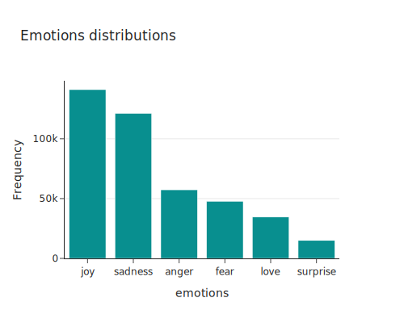
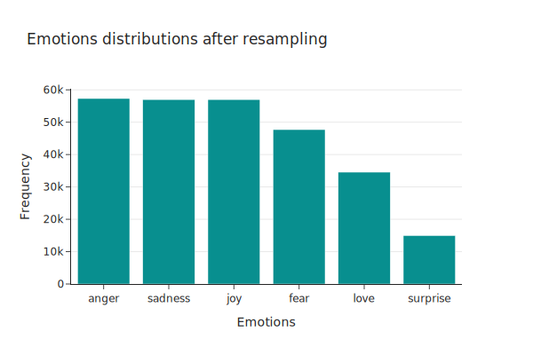

# LLM's PEFT 
This repository contains code to train LLM with diverse PEFT techniques with custom datasets.

## Task 1 - Emotion Classification

### 1.1 Dataset

The dataset was sourced from kaggle.

https://www.kaggle.com/datasets/nelgiriyewithana/emotions/data

<table>
    <tr>
      <td>
      
      </td>
      <td>
      
      </td>
     </tr>
</table>

**Fig 1**. Emotions distribution in the dataset before and after undersampling.

### 1.2 Results

|Model           |Accuracy      |Precision     | Recall      | F1         | Matthews Correlation| Training duration |
|----------------|--------------|--------------|-------------|------------|-----------|------------|
|ModernBERT-base |0.94717       |0.951624      |0.94717	     |0.94786	    |0.93579    | 2:30:55    |
|OPT-350m        |0.94708	      |0.949574	     |0.94708	     |0.94670	    |0.93545    | 2:27:34    |
|RoBERTa         |0.94438	      |0.949431	     |0.94438	     |0.94505	    |0.93248    | 1:04:35    |

### 1.3 Kruskal-Wallis test

Supervised Finetuning results with LoRA:

- RoBERTa-LoRA vs OPT-350m-LoRA, pvalue: 0.1539

- RoBERTa-LoRA vs ModernBERT-LoRA, pvalue: 0.8775

- ModernBERT-LoRA vs OPT-350m-LoRA, pvalue: 0.2053

We failed to reject the $H_0$, indicating the models' performances have the same central tendency. 

### 1.4 Trained adapters

Weights for sequence classification are available on Hugging Face.

- [RoBERTa](https://huggingface.co/Wb-az/roberta-base-lora-seq-classification/tree/main/checkpoint-53712)
- [ModernBERT](https://huggingface.co/Wb-az/modernbert-lora-adapter-for-emotion-classification/tree/main)
- [OPT](https://huggingface.co/Wb-az/opt-350-lora-adapter-for-emotions-classification/tree/main)

